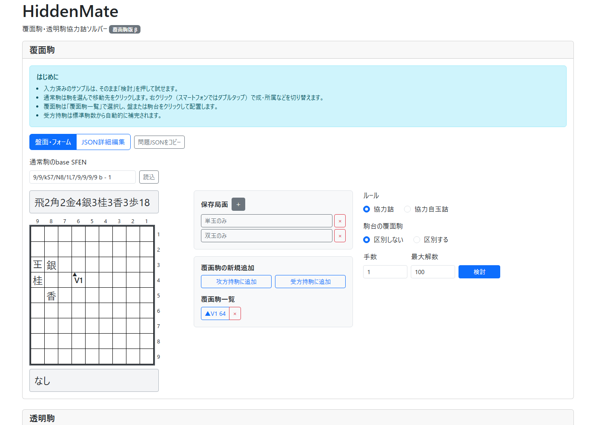

# HiddenMate

覆面駒（Variable）入りのフェアリー協力詰を検討・創作するためのソフトウェアです。現在は**覆面駒版β**を公開しており、透明駒（Invisible）の検討機能は開発中です。

Web版: **[HiddenMateを開く](https://springs022.github.io/hiddenmate/)**



高速な通常協力詰エンジン [fmrs](https://github.com/ogiekako/fmrs) を基盤にしています。確定した通常局面の合法手生成は `fmrs_core` に任せ、HiddenMate は「ここまでの手順と矛盾しない具体局面の集合」を管理します。

問題と局面は利用者のブラウザ内で処理され、外部サーバーへ送信されません。インストールせずにそのまま利用できます。

## まず試す

1. [Web版](https://springs022.github.io/hiddenmate/)を開きます。
2. 入力済みのサンプルを変更せず「検討」を押します。
3. 初形候補世界、覆面駒の候補駒種、解答が表示されます。

通常駒は駒を選択してから盤または駒台をクリックして移動します。覆面駒は「覆面駒一覧」で選択して配置します。右クリック（スマートフォンではダブルタップ）で、通常駒の成・所属や覆面駒の所属を切り替えられます。

## 覆面駒版βの実装状況

現在は、覆面駒を使用した協力詰・協力自玉詰の検討に対応しています。

## CLI

Rust環境で次を実行します。

```console
cd rust
cargo run -p hiddenmate_cli -- ../examples/variable-rook-dragon.json
```

出力例：

```text
初形候補世界: 14
  V1: {Pawn, Lance, Knight, Silver, Gold, Bishop, Rook, King, ProPawn, ProLance, ProKnight, ProSilver, ProBishop, ProRook}
解数: 3
1: 82▲(64)
2: 82▲成(64)
3: 84▲(64)
```

問題形式は [design/problem-format.md](design/problem-format.md) を参照してください。

## 開発

```console
cd rust
cargo test --workspace --no-fail-fast
cargo clippy --all-targets --all-features
```

Web版：

```console
corepack enable
pnpm install --frozen-lockfile
pnpm test
pnpm run serve
```

設計は [design/architecture.md](design/architecture.md)、公開方法は [DEPLOYMENT.md](DEPLOYMENT.md) に記載しています。

## フィードバック

不具合、対応してほしいルール、使いにくい点は [GitHub Issues](https://github.com/springs022/hiddenmate/issues) へお寄せください。再現に使った問題JSONを添えていただけると調査しやすくなります。

## ライセンスと由来

HiddenMateは [fmrs](https://github.com/ogiekako/fmrs) を基にした派生ソフトウェアです。fmrsはKeigo Oka氏によりMIT Licenseで提供されています。本リポジトリではfmrsの著作権表示とMIT License本文を保持し、HiddenMateで追加した変更部分もMIT Licenseで提供します。

ライセンス本文は [LICENSE](LICENSE)、fmrsおよび利用している第三者ソフトウェアの帰属とライセンスは [THIRD_PARTY_NOTICES.md](THIRD_PARTY_NOTICES.md) を参照してください。Web版の配布物にも、これらの文書と主要なランタイム依存ライブラリのライセンス本文を同梱しています。
